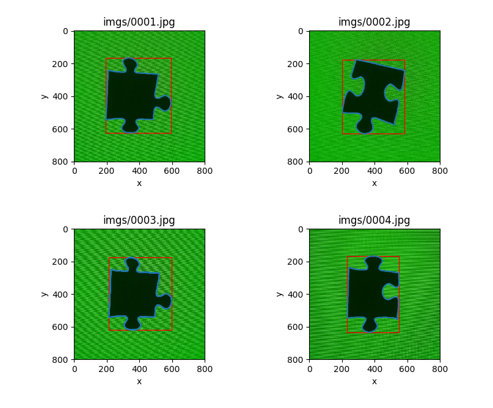

# jigSolver

This program solve jigsaw puzzles in the following steps:

# 1. find edges (contours)

> I chose a single colored background for the puzzle pieces, for better edge detection results;  
> hopefully the edges would be accurate enough for matching without all the color information on the piece.

27/05 update:


# 2. find matching edges

> todo

# 3. match the pieces

> todo


PS: VS Code Settings
```
"python.linting.pylintArgs": [
    "--extension-pkg-whitelist=cv2"
]
```